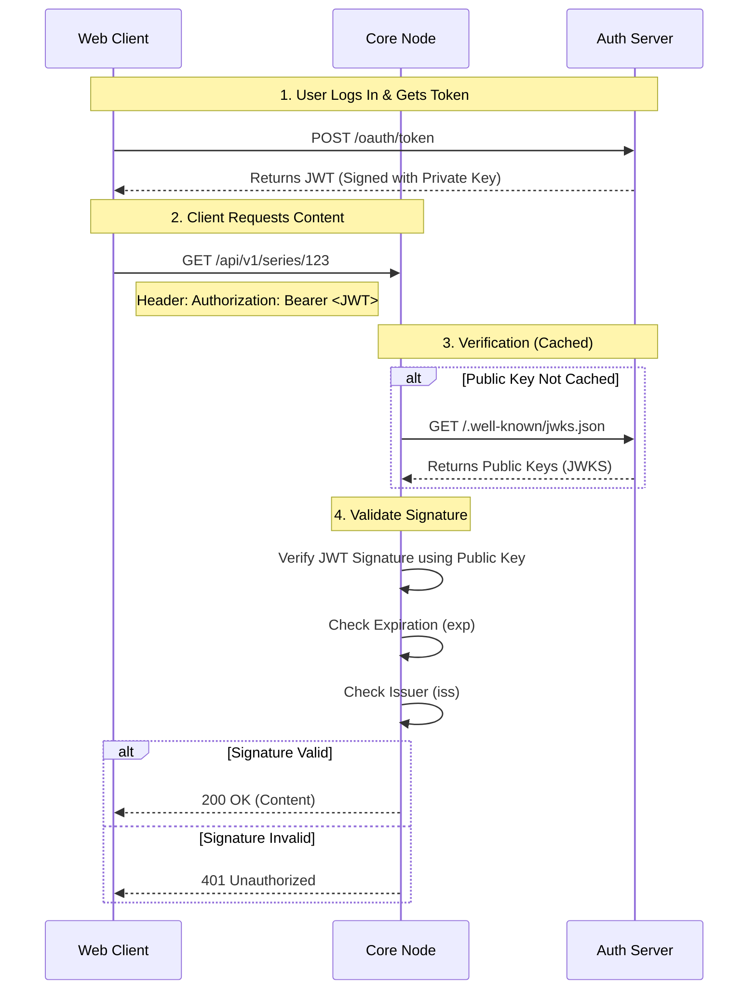

# Security Architecture

MehguViewer operates on a **Federated Trust Model**. While the network is decentralized, individual Nodes are authoritative over their own content and users. Security is enforced via **JSON Web Tokens (JWT)** issued by an Auth Server and validated by Core Nodes.

## 1. The Stateless Trust Handshake

One of the most critical aspects of the MehguViewer Protocol is the **Stateless Trust Handshake**. This allows any Core Node (Content Server) to verify a user's identity and global level without ever needing to connect to the Auth Server's database.

### The Handshake Flow

When a user logs in, they receive a **Signed JWT (JSON Web Token)** from the Auth Server. This token is cryptographically signed using a private key that only the Auth Server possesses.

The Core Node does not need to "ask" the Auth Server if a token is valid for every request. Instead, it performs a mathematical verification using the Auth Server's **Public Key**.



## 2. The Scope Standard

To ensure interoperability, all Auth Servers and Core Nodes MUST support the following standard scopes. These scopes are embedded in the `scope` claim of the JWT.

| Scope | Description |
| :--- | :--- |
| `openid profile email` | Standard OIDC scopes. Grants access to identity claims. |
| `mvn:read` | **Basic Access.** Allows reading public series, chapters, and comments. |
| `mvn:social:write` | **Social Access.** Allows posting comments, voting, and creating collections. |
| `mvn:ingest` | **Contributor Access.** Allows uploading Series and Chapters. Typically reserved for Scanlation Groups or Node Admins. |
| `mvn:admin` | **Root Access.** Full destructive capabilities (Delete Series, Ban Users, Manage Node Config). |

## 3. Enforcement Rules

Core Nodes are the "Gatekeepers". They must validate the JWT signature and check for the required scope before processing a request.

### Read Operations
Most `GET` operations (e.g., `GET /series`, `GET /comments`) require `mvn:read`.
*   **Public Nodes:** May allow unauthenticated access to `mvn:read` endpoints (Guest Mode).
*   **Private Nodes:** MUST reject requests without `mvn:read` with `401 Unauthorized`.

### Write Operations
All state-changing operations (`POST`, `PUT`, `DELETE`) MUST require authentication.

*   **Social Actions:** `POST /comments`, `POST /collections` require `mvn:social:write`.
*   **Ingestion:** `POST /series`, `POST /chapters` require `mvn:ingest`.
    *   If a user attempts to upload without this scope, the Core Node **MUST** return `403 Forbidden`.

### Moderation
*   **Reports:** `POST /reports` requires `mvn:social:write` (to prevent spam from unverified users).
*   **Admin Actions:** Deleting content owned by others requires `mvn:admin`.

## 4. Trusting Claims

Once the signature is verified, the Core Node **blindly trusts** the claims inside the token. This is why the Auth Server must be the only entity capable of signing tokens.

### Critical Claims
The Core Node relies on these specific fields:

-   `sub` (Subject): The immutable User ID. Used to link comments and votes.
-   `iss` (Issuer): The URL of the Auth Server. Used to fetch the correct JWKS.
-   `global_level`: The user's level. Used to unlock level-gated content (if applicable).
-   `role`: (Optional) Global roles like "Moderator".

### Example JWT Payload

```json
{
  "iss": "https://auth.mehgu.example.com",
  "sub": "urn:mvn:user:123...",
  "aud": "https://core.mehgu.example.com",
  "scope": "openid profile mvn:read mvn:social:write",
  "exp": 1735689600
}
```

## 5. Security Implications

1.  **Key Rotation:** The Auth Server should rotate keys periodically. Core Nodes must respect the `Cache-Control` headers of the JWKS endpoint to ensure they fetch new keys when necessary.
2.  **Revocation:** Because verification is stateless, immediate revocation is difficult. We rely on short-lived Access Tokens (e.g., 15 minutes) and Refresh Tokens for long-term sessions.
