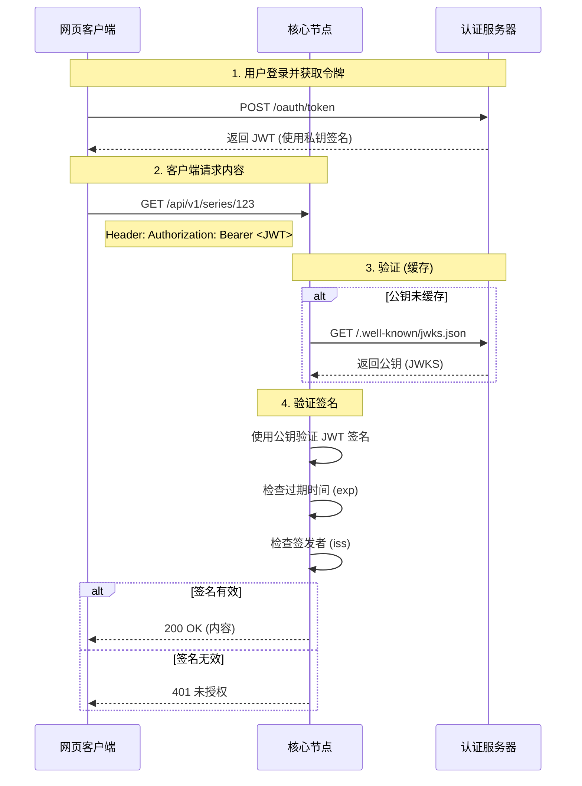

# 安全架构

MehguViewer 基于**联邦信任模型**运作。虽然网络是去中心化的,但各个节点对自身内容和用户拥有绝对权威。安全性通过由认证服务器签发、核心节点验证的 **JSON Web Tokens (JWT)** 来强制执行。

## 1. 无状态信任握手

MehguViewer 协议最关键的方面之一是**无状态信任握手**。这允许任何核心节点(内容服务器)在无需连接到认证服务器数据库的情况下验证用户的身份和全局等级。

### 握手流程

当用户登录时,他们会从认证服务器收到一个**签名的 JWT (JSON Web Token)**。这个令牌使用只有认证服务器拥有的私钥进行加密签名。

核心节点不需要在每次请求时都"询问"认证服务器令牌是否有效。相反,它使用认证服务器的**公钥**执行数学验证。



## 2. 作用域标准

为确保互操作性,所有认证服务器和核心节点必须支持以下标准作用域。这些作用域嵌入在 JWT 的 `scope` 声明中。

| 作用域 | 描述 |
| :--- | :--- |
| `openid profile email` | 标准 OIDC 作用域。授予访问身份声明的权限。 |
| `mvn:read` | **基础访问**。允许读取公开的系列、章节和评论。 |
| `mvn:social:write` | **社交访问**。允许发表评论、投票和创建收藏。 |
| `mvn:ingest` | **贡献者访问**。允许上传系列和章节。通常为汉化组或节点管理员保留。 |
| `mvn:admin` | **根访问**。完全破坏性权限(删除系列、封禁用户、管理节点配置)。 |

## 3. 强制规则

核心节点是"守门员"。它们必须验证 JWT 签名并在处理请求前检查所需的作用域。

### 读取操作
大多数 `GET` 操作(例如 `GET /series`、`GET /comments`)需要 `mvn:read`。
*   **公开节点:** 可能允许未认证访问 `mvn:read` 端点(访客模式)。
*   **私有节点:** 必须以 `401 未授权` 拒绝没有 `mvn:read` 的请求。

### 写入操作
所有改变状态的操作(`POST`、`PUT`、`DELETE`)必须要求认证。

*   **社交操作:** `POST /comments`、`POST /collections` 需要 `mvn:social:write`。
*   **内容注入:** `POST /series`、`POST /chapters` 需要 `mvn:ingest`。
    *   如果用户尝试在没有此作用域的情况下上传,核心节点**必须**返回 `403 禁止访问`。

### 审核
*   **举报:** `POST /reports` 需要 `mvn:social:write`(以防止未验证用户的垃圾信息)。
*   **管理员操作:** 删除他人拥有的内容需要 `mvn:admin`。

## 4. 信任声明

一旦签名被验证,核心节点**完全信任**令牌内部的声明。这就是为什么认证服务器必须是唯一能够签发令牌的实体。

### 关键声明
核心节点依赖这些特定字段:

-   `sub` (主题): 不可变的用户 ID。用于链接评论和投票。
-   `iss` (签发者): 认证服务器的 URL。用于获取正确的 JWKS。
-   `global_level`: 用户等级。用于解锁等级限制的内容(如果适用)。
-   `role`: (可选) 全局角色如"版主"。

### JWT 载荷示例

```json
{
  "iss": "https://auth.mehgu.example.com",
  "sub": "urn:mvn:user:123...",
  "aud": "https://core.mehgu.example.com",
  "scope": "openid profile mvn:read mvn:social:write",
  "exp": 1735689600
}
```

## 5. 安全影响

1.  **密钥轮换:** 认证服务器应定期轮换密钥。核心节点必须遵守 JWKS 端点的 `Cache-Control` 头以确保在必要时获取新密钥。
2.  **撤销:** 由于验证是无状态的,立即撤销很困难。我们依赖短期访问令牌(例如 15 分钟)和长期会话的刷新令牌。
