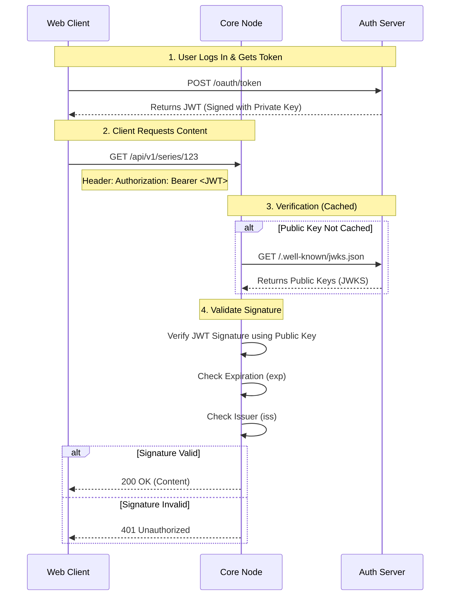

# The Trust Model

One of the most critical aspects of the MehguViewer Protocol is the **Stateless Trust Handshake**. This allows any Core Node (Content Server) to verify a user's identity and global level without ever needing to connect to the Auth Server's database.

## Stateless Verification

When a user logs in, they receive a **Signed JWT (JSON Web Token)** from the Auth Server. This token is cryptographically signed using a private key that only the Auth Server possesses.

The Core Node does not need to "ask" the Auth Server if a token is valid for every request. Instead, it performs a mathematical verification using the Auth Server's **Public Key**.

### The Handshake Flow

## Trusting Claims

Once the signature is verified, the Core Node **blindly trusts** the claims inside the token. This is why the Auth Server must be the only entity capable of signing tokens.

### Critical Claims
The Core Node relies on these specific fields:

-   `sub` (Subject): The immutable User ID. Used to link comments and votes.
-   `iss` (Issuer): The URL of the Auth Server. Used to fetch the correct JWKS.
-   `global_level`: The user's level. Used to unlock level-gated content (if applicable).
-   `role`: (Optional) Global roles like "Moderator".

## Security Implications

1.  **Key Rotation:** The Auth Server should rotate keys periodically. Core Nodes must respect the `Cache-Control` headers of the JWKS endpoint to ensure they fetch new keys when necessary.
2.  **Revocation:** Because verification is stateless, immediate revocation is difficult. We rely on short-lived Access Tokens (e.g., 15 minutes) and Refresh Tokens for long-term sessions.
