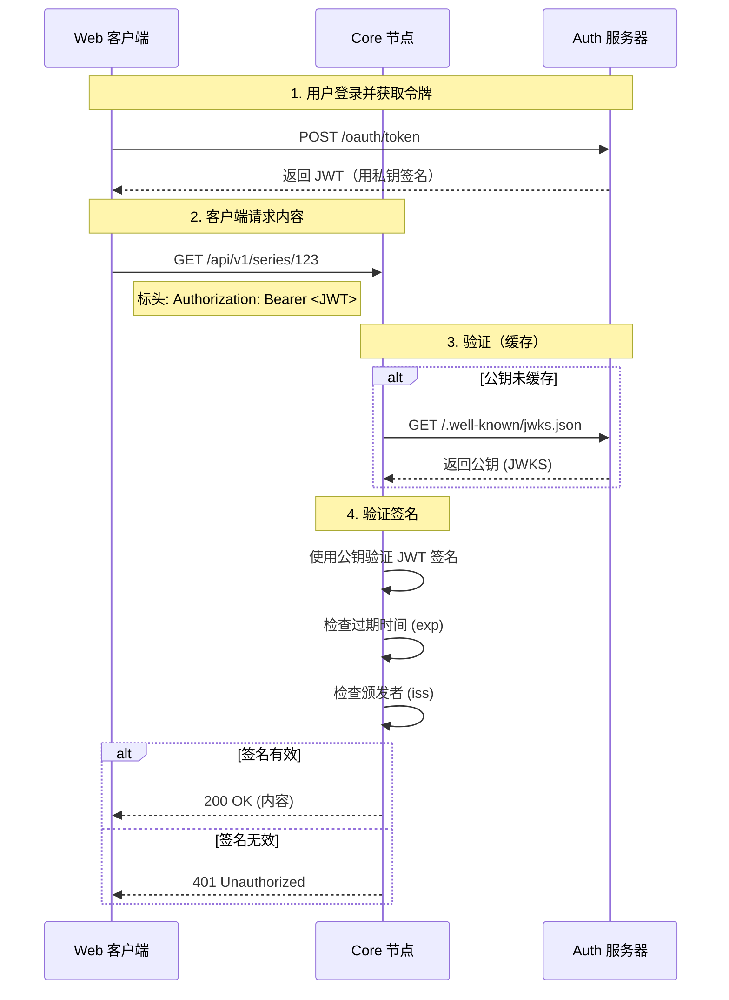

# 信任模型

MehguViewer 协议最关键的一个方面是 **无状态信任握手**。这允许任何 Core 节点（内容服务器）验证用户的身份和全局等级，而无需连接到 Auth 服务器的数据库。

## 无状态验证

当用户登录时，他们会从 Auth 服务器收到一个 **签名 JWT（JSON Web Token）**。此令牌使用只有 Auth 服务器拥有的私钥进行加密签名。

Core 节点不需要为每个请求"询问" Auth 服务器令牌是否有效。相反，它使用 Auth 服务器的 **公钥** 进行数学验证。

### 握手流程

## 信任声明

一旦签名通过验证，Core 节点将 **盲目信任** 令牌内的声明。这就是为什么 Auth 服务器必须是唯一能够签署令牌的实体。

### 关键声明
Core 节点依赖于这些特定字段：

-   `sub` (Subject): 不可变的用户 ID。用于链接评论和投票。
-   `iss` (Issuer): Auth 服务器的 URL。用于获取正确的 JWKS。
-   `global_level`: 用户的等级。用于解锁等级限制的内容（如果适用）。
-   `role`: (可选) 全局角色，如"版主"。

## 安全隐患

1.  **密钥轮换：** Auth 服务器应定期轮换密钥。Core 节点必须遵守 JWKS 端点的 `Cache-Control` 标头，以确保在必要时获取新密钥。
2.  **撤销：** 由于验证是无状态的，立即撤销很困难。我们依赖短期的访问令牌（例如 15 分钟）和用于长期会话的刷新令牌。
